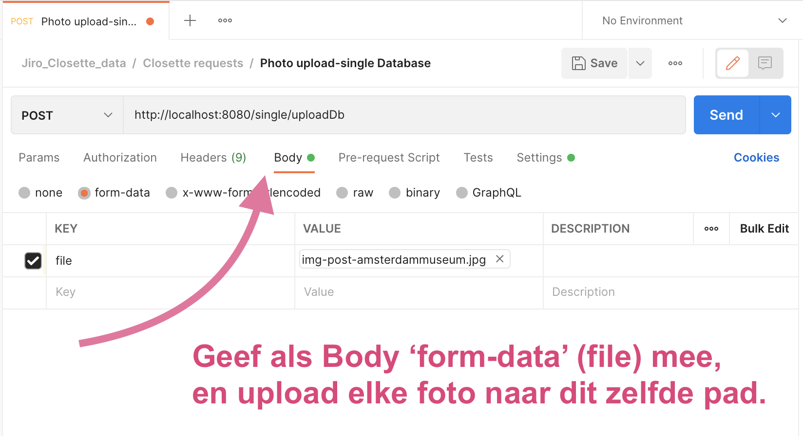

# Closette App installatiehandleiding Markdown versie

door Jiro Ghianni

### tekst-only versie

# Deze installatiehandleiding staat hier ook als mooiere PDF

Zie de PDF in deze zelfde LEESMIJ directory:

[installatiehandleiding-closette.pdf](installatiehandleiding-closette.pdf)

Dit tekstdocument is als basis gebruikt voor de PDF.

## Inhoud

1. Lijst van benodigdheden back-end
2. Stappenplan back-end
3. Lijst van alle rest endpoints
4. Lijst van benodigdheden front-end
5. Stappenplan front-end
6. Aandachtspunten front-end

## Introductie

Houd deze repository bijelkaar binnen 1 directory. Dat wil zeggen: sleep de front-end map _niet_ naar een andere plek ten opzichte van de back-end. Dit in verband met de paden van een aantal standaard-afbeeldingen die als voorbeeld zijn gebruikt om de database te vullen.

⚠️ Let op: wanneer je dit project in 1 keer binnen een IDE importeert van Github, dan moet je er rekening mee houden dat de start scripts in de ***sub directories*** staan, dus 1 map lager dan de ROOT! Dit heeft invloed op het opstarten van zowel de back- als de front-end. Het is daarom eenvoudiger om dit project te DOWNLOADEN als ZIP, deze uit te pakken, en daarna de individuele mappen als 'root' te openen in een IDE naar keuze. 

## Complete installatie kort samengevat

1. download de gehele ZIP van Github (dus: _niet_ uitchecken als versioncontrolled project) en pak deze uit op je lokale machine.
2. open de backend-closette map in een Java-ready IDE of console.
3. verander de database gegevens zoals hieronder aangegeven.
4. verander het upload pad naar de `Public/uploads` map in de front-end directory én vul de database met uploads via Postman of front-end.
5. run eventueel Maven vanuit de backend map, en start de Java applicatie `ClosetteApp` in de SRC/main map.
5. open de frontend-closette map in een React-ready IDE of console.
6. run `$ npm install` en `$ npm start` **_vanuit_** de front-end folder zelf.
7. bekijk de front-end in een browser.

Zie voor verdere uitleg hieronder.

# Back-end Applicatie starten ~ uitgebreid

1. Lijst van benodigdheden Back-End
2. Stappenplan back-end
3. Lijst van alle rest endpoints

## 1. Lijst van benodigdheden Back-End

Voor de installatie is een werkende internet verbinding vereist.

Verder: voor de back-end is een IDE nodig die Java code kan uitvoeren en om kan gaan met Spring Boot en Maven en een Tomcat server op kan starten, bij voorkeur IntelliJ Idea. Er moet tevens een PostgreSQL database omgeving zijn, die eventueel beheerd kan worden via een programma zoals PgAdmin. Tevens is er voor het uploaden van de vooraf-in-te-laden foto’s het programma Postman nodig.

**Download links**

* PostgreSQL https://www.postgresql.org
* pgAdmin https://www.pgadmin.org
* IntelliJ https://www.jetbrains.com/idea/
* Postman https://www.postman.com/downloads/

## 2. Stappenplan back-end

### Back-end aanpassingen database

Belangrijk: verander eerst deze lokale instellingen!

De database settings, in (bijvoorbeeld) pgAdmin:
* postgresql database op localhost:5432 (port 5432)
* databasenaam: closette
* user/owner: springboot
* password: springboot

Maak dus eerst een user aan met naam/wachtwoord `springboot`. En daarna een lege database met de naam `closette`, gekoppeld aan deze user.

### Standaard users

* admin - password
* user - password
* tester - password

### Back-end pad voor uploads

Belangrijk: Pas in de `main/resources/application.properties` het Upload-pad voor afbeeldingen aan: voor Mac gebruikers zal dit vlekkeloos verlopen omdat daar nooit Backslashes gebruikt worden, maar Windowsgebruikers moeten opletten dat er soms een Backslash in hun code nodig is daar waar een Slash moet staan. Het lokale pad hier dienen alle gebruikers in ieder geval aan te passen vanaf het 'Users' path naar de locatie van de front-end public/uploads directory op jouw eigen machine:

`app.uploads= /Users/jolarti/webdevelopment/closette/frontend-closette/public/uploads`

Let op: dit lokale pad MOET verwijzen naar de uploads directory die in de Public Directory staat van de Frontend-closette map:

Het mag dus niet een willekeurige map zijn, maar moet specifiek naar deze map verwijzen. Dit in verband met een aantal 'prefilled' images = vooraf gevulde afbeeldingen die in die upload staan en door de database worden ingelezen waardoor de  app re representatief uitziet.

Deze app is gebouwd op een Mac, dus het is mogelijk dat Windows/Linux gebruikers in de code nog 1 extra aanpassing moeten doen; zie het commentaar in het bestand in de backend-closette directory in regel 61 in het bestand in /main ... /service/FileStorageService

Windows users moeten hier mogelijk een BACKSLASH invoeren in plaats van de SLASH die daar staat, resultaat:

`Path filePath = Paths.get(fileStoragePath + "\\" + fileName);`

## De vooraf ingeladen foto’s

De database heeft 15 foto’s die vooraf ingeladen moeten worden, omdat deze gekoppeld zijn aan de id’s van de toilet- entries. Helaas is het niet voldoende om alleen de data.sql in te laden, omdat de foto’s zijn omgezet naar een zogenaamde ‘**byte array**’ die voor elke lokale machine een uniek cijfer geeft. Dit unieke lokale gedrag schijnt iets met de data access object (DAO) te maken te hebben.

Gelukkig is er een oplossing: via Postman – of zelfs via de front-end – kunnen de foto’s die reeds in de Uploads map staan, allemaal opnieuw naar jouw lokale database geüpload worden, zodat deze lokaal op jouw eigen machine een nieuw uniek cijfer krijgen. Dit cijfer heet ‘`doc_file`’ en dient veranderd te worden in het data.sql bestand dat in de Resources map staat, op deze manier:

Open in Postman het request dat een POST doet naar het pad
`http://localhost:8080/single/uploadDb`
en upload daar 1-voor-1 alle images uit de **Public/Uploads** directory die in de **frontend-closette** map staan:

Bekijk daarna welke cijfers er nu zijn meegegeven in jouw eigen  PostGreSQL database:

Nu kun je het `data.sql` bestand aanpassen en bewaren, vóórdat je de server start (of herstart):

### JAVA versie

Dit project werkt alleen wanneer je JDK versie 17 of hoger hebt geïnstalleerd op je computer. Wanneer je deze niet hebt, kun je deze downloaden via https://jdk.java.net

### Installatie en opstarten back-end

Als je het project gedownload hebt naar jouw locale machine, en de aanpassingen hierboven hebt gedaan, installeer je eerst de back-end. Liefst via een Java-ready/Maven-ready IDE zoals IntelliJ maar het kan ook door de `backend-closette` folder te openen in elke terminal van jouw keuze.

Je IDE kan als notificatie de vraag stellen of Maven dit project mag vertrouwen, zeg dan 'yes' op de trust vraag. En accepteer JPA buddy en de andere plugins wanneer daar akkoord op wordt gevraagd. Indien IntelliJ vraagt om een DataSource of SQL dialect te kiezen, _doe dit dan NIET_, laat het zoals het is. En klik OK op de JPA Buddy default configuratie.

In de meeste gevallen volstaat het om de _backend-closette_ map te openen in een IDE, die Java kan complieren, en het pom-bestand van Maven te laten installeren, waarna de Main klasse `ClosetteApp` gedraaid (run) kan worden. (Het back-end startscript staat in `bckend-closette/pom.xml`). Maar installatie en runnen vanuit de `backend-closette` directory kan ook in 1 keer via een terminal naar keuze met het commando:

`$ mvn spring-boot:run`.

In de terminal kan de back-end app gestopt worden met de toetscombinatie `ctrl` + `'C'`.

Bij back-end problemen:
* install `pom.xml`
* of type `./mvnw verify` (mac/linux) of `mvnw.cmd verify` (windows) uit in de terminal van de project directory/folder.

Laatste stap voor de back-end:

Start de Main klasse `ClosetteApp` op (= run).

## 3. Lijst van alle rest endpoints

Onderstaande endpoints heb ik tevens gepubliceerd op deze documentatie site (inclusief beschrijvingen):
https://documenter.getpostman.com/view/17991980/UVeCR95T  - en in de 'LEESMIJ' map staat een makkelijk te importeren verzameling van [alle Postman requests](LEESMIJ/Jiro_Closette_data.postman_collection.json) (JSON);

* {PUT [/users/{username}]}
* {PUT [/toilets/{id}]}
* {PUT [/news/{id}]}
* {POST [/users/register]}
* {POST [/users/{username}/ratings]}
* {POST [/users/{username}/authorities]}
* {POST [/toilets/{id}/ratings]}
* {POST [/toilets/{id}/photos]}
* {POST [/toilets]}
* {POST [/single/uploadDb]}
* {POST [/single/upload]}
* {POST [/ratings]}
* {POST [/news]}
* {POST [/authenticate]}
* {PATCH [/users/{username}/password]}
* {PATCH [/toiletsdto/{id}]}
* {PATCH [/toilets/{id}]}
* {PATCH [/toilets/{id}/ratings]}
* {PATCH [/single/uploadDb/{id}]}
* {PATCH [/news/{id}]}
* {GET [/users/{username}/authorities]}
* {GET [/users/{username}]}
* {GET [/users]}
* {GET [/toilets/{id}/ratings]}
* {GET [/toilets/{id}/photos]}
* {GET [/toilets/{id}]}
* {GET [/toilets]}
* {GET [/ratings/{id}]}
* {GET [/ratings]}
* {GET [/photos/{id}]}
* {GET [/photos]}
* {GET [/news/{id}]}
* {GET [/news]}
* {GET [/downloadFromDB/{fileName}]}
* {GET [/download/{fileName}]}
* {GET [/alluploads]}
* {DELETE [/users/{username}/authorities/{authority}]}
* {DELETE [/users/{username}]}
* {DELETE [/toilets/{id}]}
* {DELETE [/news/{id}]}
* { [/error]}
* { [/error], produces [text/html]}

#### Server requests

De back-end wordt aangesproken door de front-end, maar als je alleen via Postman requests wil doen, dan kan dat ook: Open http://localhost:8080 voor requests.

De Postman export staat ook nog eens dubbelop in de ['back-end documentation'](../backend-closette/documentation/Jiro_Closette_data.postman_collection.json) map: deze kun je ook importeren in Postman en daarin gemakkelijk meteen uitvoeren.

---

# Front-end Applicatie starten ~ uitgebreid

4. Lijst van benodigdheden front-End
5. Stappenplan front-end
6. Aandachtspunten front-end

## 4. Lijst van benodigdheden front-End

Voor de installatie is een werkende internet verbinding vereist.

Verder: voor de front-end is een IDE nodig die javascript en JSX/React code kan uitvoeren. Ook dient Nodejs en NPM (15.4.0 of hoger) geinstalleerd te zijn.

**Download links:**

* Webstorm (betaald) https://www.jetbrains.com/webstorm/
* Nodejs https://nodejs.org/en/download/
* (NPM zit al in NodeJs)

## 5. Stappenplan front-end

Als je het project gedownload hebt naar jouw locale machine, en je de back-end hebt opgestart, installeer je (vanuit de `frontend-closette` map) eerst de node_modules door het volgende commando in een terminal te runnen:

`$ npm install`

NB: Het opstart script voor de front-end staat dus 1 directory lager dan deze readme. Dit betekent dat je, wanneer je dit project importeert vanuit Github (version control) je het start-script dan niet meteen kunt runnen (het front-end startscript staat in `frontend-closette/package.json`). Wanneer je een IDE als Webstorm wilt gebruiken, open het project dan _niet_ als 'version-control' project maar: ga in een browser naar Github, download de repository als ZIP, pak dit uit waar je maar wilt, en open dan alleen de `frontend-closette` map in een IDE naar keuze (bijvoorbeeld Webstorm, of Visual Studio met een React plug-in).

Wanneer dit klaar is, kun je (wederom vanuit de `frontend-closette` map) de applicatie starten met behulp van:

`$ npm start`

Als je dit project opent in Webstorm kun je hiervoor ook het NPM START afspeelknopje gebruiken.

Je IDE kan als notificatie de vraag stellen of je browser (bijvoorbeeld Chrome) deze app mag vertrouwen; beantwoordt bevestigend op elke trust vraag. Open http://localhost:3000 om de web-app in een browser te bekijken en te bedienen.

Axios, ESLint, React Router 5.2, React-Hook-Form, JWT-decoder, emailJS etc. zijn reeds gesaved in JSON builder en worden automatisch mee geïnstalleerd.

In de terminal kan de front-end app gestopt worden met `ctrl` + `'C'`.

## 6. Aandachtspunten front-end

### Nodejs / npm versie

Dit project werkt alleen wanneer je Nodejs versie Node.js 15.4.0 of hoger hebt geïnstalleerd op je computer. Wanneer je deze niet hebt, kun je deze downloaden via https://nodejs.org/en/download/releases/

### Voorkeur browsers

NB: Gebruik bij voorkeur **Chrome**, **Edge** of **Opera**. Natuurlijk werkt alles ook in Firefox en Safari maar sommige fonts worden daarin niet mooi 'bold' gerendered. Ook wordt op sommige afbeeldingen het 'filter' CSS attribuut gebruikt, deze werkt momenteel nog niet altijd goed in Edge (en al helemaal niet in Explorer).