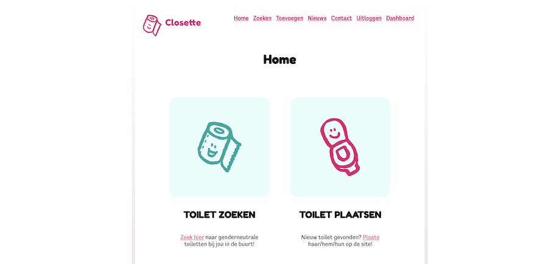

# Fullstack Closette App

door Jiro Ghianni

## Inhoud en installatie

Welkom bij de _Closette ~ genderneutrale toiletten zoek-app_. Deze applicatie kun je zelf installeren via de installatie handleiding. Alle toelichtingen en uitleg over hoe deze app inelkaar zit, kun je hier vinden:

* Deze Readme...

    * ... beschrijft waar alle documenten en applicaties te vinden zijn

    * ... bevat de link naar de GIT repository waarnaar het project geüpload
is: [Jiro's Github Fullstack Closette App](https://github.com/JirosWorld/fullstack-closette-app).

* ⚠️ in de 'LEESMIJ' map staat alle documentatie bijelkaar, inclusief de Installatiehandleiding:  [link naar installatiehandleiding in markdown](LEESMIJ/installatiehandleiding.md)

* Zowel de Front-end als de Back-end map hebben nog eens dubbelop hun eigen documentatie in een Readme file. Dit is extra dubbelop overkill ja, maar het maakt het wel makkelijker om documentatie te bereiken zodra je deze folders als Root hebt geopend in verschillende IDE's.

* in de 'LEESMIJ' map staat het Functioneel ontwerp + het Technisch ontwerp [**samen** in één PDF](LEESMIJ/functioneel-technisch-ontwerp-app-jiro.pdf) (9 MB); _(er is ook een ['text-only' markdown versie](LEESMIJ/functioneel-technisch.md))_

* Broncode van beide projecten staat in de ZIP en het online Github-project.

* in de 'LEESMIJ' map staat ook het Verantwoordingsdocument: [link naar Verantwoordingsdocument in markdown](LEESMIJ/verantwoordingsdocument.md)

* in de 'LEESMIJ' map staat de verzameling van [alle Endpoint + Postman requests](LEESMIJ/Jiro_Closette_data.postman_collection.json) (JSON); De endpoints heb ik tevens gepubliceerd op deze documentatie site (inclusief beschrijvingen):
  https://documenter.getpostman.com/view/17991980/UVeCR95T

* link naar de Figma ontwerpen:
  https://www.figma.com/file/yv5hJQVzTMvwTT31oyQBRE/Jiro-Closette-design?node-id=0%3A1

### Leuke extra’s

Ik hoop dat nieuwe programmeurs gevoeliger gaan zijn voor diversiteit en nooit meer databases ontwerpen waarin gender slechts een boolean is. 
Lees mijn stuk over diversiteit in code hier:
https://codepen.io/jirosworld/post/how-to-build-diversity-into-your-code

Veel plezier met nakijken!

Saluut,

Jiro Ghianni
2021 / 2022

